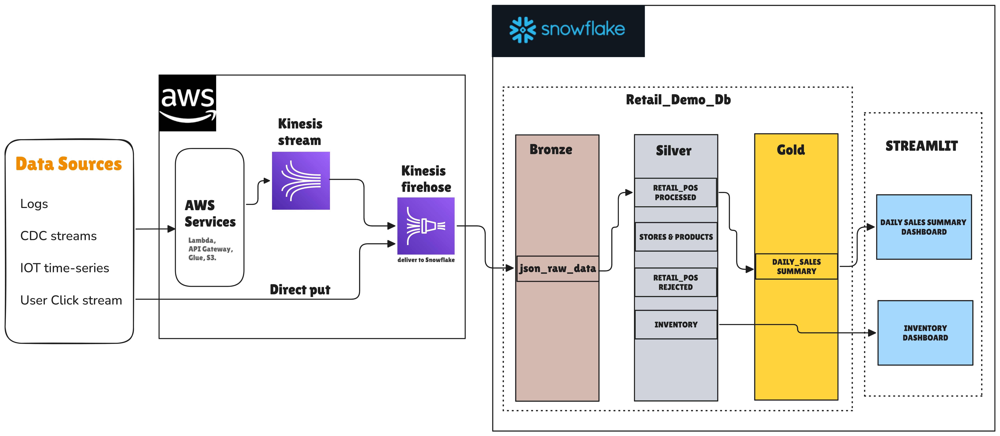

# Real-Time Retail Data Pipeline with Snowflake & AWS

## 📖 Project Overview

This project implements a scalable, end-to-end data engineering pipeline for processing retail Point of Sale (POS) data in real-time. It leverages **AWS Kinesis** for high-throughput ingestion and **Snowflake** for data warehousing and transformation.

The pipeline follows the **Medallion Architecture** (Bronze → Silver → Gold) to progressively clean, validate, and aggregate data, culminating in live dashboards powered by **Streamlit**.

---

## 🏗️ System Architecture

### 1. Ingestion Layer (AWS)
* **Data Sources:** Captures diverse data streams including App Logs, CDC streams, IoT time-series, and User Clickstreams.
* **Streaming:** Uses **Amazon Kinesis Data Streams** to buffer incoming events.
* **Delivery:** **Amazon Kinesis Firehose** batches and delivers raw JSON data directly into the Snowflake staging table.

### 2. Transformation Layer (Snowflake)
The core logic resides within Snowflake, utilizing **Streams and Tasks** for Change Data Capture (CDC) and orchestration.

#### 🟤 Bronze Zone (Raw Ingestion)
* `json_raw_data`: Stores the raw JSON payloads exactly as received from Firehose.
* **Stream on Raw:** Monitors the Bronze table for new insertions to trigger downstream processing.

#### ⚪ Silver Zone (Cleansing & Validation)
* **Stored Procedure & Task:** A scheduled task invokes a stored procedure to parse the JSON.
* **Data Quality Check:** The procedure validates schema, checks for missing fields, and handles type mismatches.
* **Routing Logic:**
    * ✅ **Valid Records:** Normalized and merged into the `RETAIL_POS_PROCESSED` table.
    * ❌ **Invalid Records:** Routed to `RETAIL_POS_REJECTED` for audit and debugging.
* **Inventory Update:** A secondary stream triggers updates to the `INVENTORY` table based on processed sales.

#### 🟡 Gold Zone (Aggregation)
* `DAILY_SALES_SUMMARY`: Aggregated business-level data optimized for reporting.
* Updates are driven by streams off the Silver layer to ensure near real-time reporting accuracy.

### 3. Consumption Layer (Streamlit)
Two interactive dashboards consume the Gold and Silver data:
* 📊 **Daily Sales Summary Dashboard:** For executive reporting on revenue and trends.
* 📦 **Inventory Dashboard:** For operational monitoring of stock levels.

---

## ⚡ Key Technical Features

* **Event-Driven:** No manual batches; processing is triggered as soon as data arrives.
* **Error Handling:** "Dead Letter Queue" style logic separates bad data without stopping the pipeline.
* **Idempotency:** The pipeline uses `MERGE` logic to prevent duplicate processing.
* **Scalability:** Built on serverless AWS and Snowflake infrastructure.

---

## 🛠️ Tech Stack

* **Cloud:** AWS (Kinesis Streams, Firehose)
* **Data Warehouse:** Snowflake
* **Orchestration:** Snowflake Tasks (Cron/Interval based)
* **CDC:** Snowflake Streams
* **Languages:** SQL, Python (Streamlit)

---

## 📄 License

This project is licensed under the MIT License - see the [LICENSE](LICENSE) file for details.

